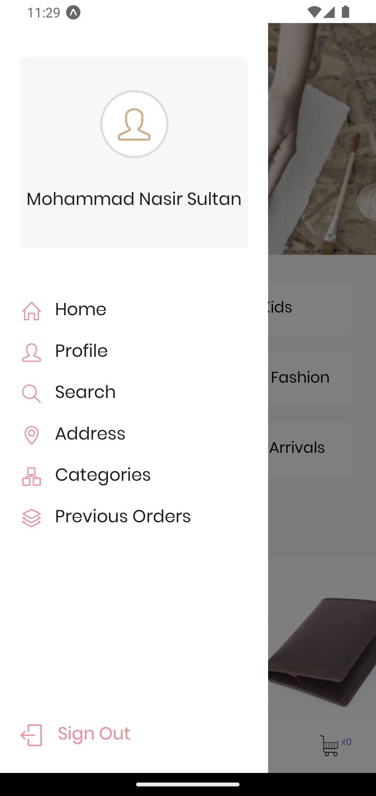
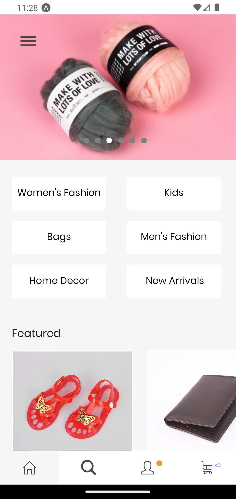
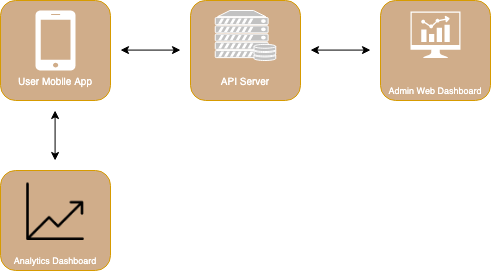

# Ecommero Mobile

 
 <b>Ecoomtive</b>, la solución integral de comercio electrónico que funciona en plataformas iOS, Android y Web. Con un diseño moderno y características completas, Ecomtive proporciona una solución de aplicación fácil de implementar para cualquier empresa de comercio electrónico.

Desarrollado con React Native y Expo para dispositivos móviles, y React para el panel de administración, Ecommero permite una integración perfecta con cualquier plataforma de comercio electrónico. La gestión de estado y las consultas a los endpoints se simplifican con Apollo Client, mientras que la API está construida con Node y MongoDB.

Ecommero proporciona todas las funciones necesarias para optimizar tu negocio de comercio electrónico. Las notificaciones push para plataformas móviles y web mantienen a tus clientes comprometidos e informados, mientras que el panel de análisis para la aplicación móvil te permite rastrear el comportamiento del cliente y optimizar la aplicación en consecuencia. La integración de pagos con PayPal y tarjetas de crédito y débito garantiza un proceso de transacción seguro y sin problemas, mientras que la función de seguimiento de pedidos brinda información en tiempo real a los clientes sobre el estado de sus pedidos, mejorando su experiencia de compra.

La integración de correo electrónico asegura que los clientes reciban confirmaciones de pedidos y actualizaciones de envío, mientras que las funciones de valoración y reseñas proporcionan retroalimentación valiosa para mejorar tu negocio. La integración con GPS facilita que los clientes encuentren su dirección, mientras que la autenticación con Facebook y Google proporciona una experiencia de inicio de sesión sin inconvenientes.

El panel de administración responsivo facilita la gestión del comercio electrónico, mientras que la función de variaciones de productos permite mostrar y vender diferentes versiones de un mismo producto.

En general, Ecommero es una solución completa y personalizable para cualquier negocio de comercio electrónico. Con sus funciones robustas, diseño moderno e integración fluida, Ecommero es la aplicación ideal para optimizar tu plataforma de comercio electrónico.

- Versiones de iOS compatibles: 11+
- Versiones de Android compatibles: 6.0+

<b>Este es el código fuente gratuito completo de nuestra solución, sin embargo, el backend y la API son propietarios y se pueden obtener mediante una licencia de pago.</b>

## Qué está incluido:

Ecommero ofrece una solución integral de comercio electrónico con dos módulos distintos: el panel de administración y la aplicación Ecommero.

- El panel de administración te permite gestionar pedidos, rastrear ventas y manejar cuentas de clientes de manera eficiente. Es tu centro de comando para el control total de tu negocio de comercio electrónico.

- La aplicación Ecommero proporciona una plataforma fácil de usar para que los clientes personalicen y realicen sus pedidos con facilidad. Con una amplia selección de productos, los clientes pueden personalizar sus compras, asegurando una experiencia de compra sin complicaciones.

## Características:

Incluye todas las funciones necesarias para implementar esta aplicación en cualquier empresa de comercio electrónico. Algunas de sus características incluyen:

- Panel de análisis para la aplicación móvil
- Integración de pagos con PayPal y Stripe
- Funcionalidad de seguimiento de pedidos
- Integración de correo electrónico (para confirmaciones de pedidos, etc.)
- Posibilidad de valoraciones y reseñas
- Búsqueda de direcciones mediante integración con GPS
- Autenticación con Facebook y Google
- Panel de administración responsivo
- Variaciones de productos
- Notificaciones push para plataformas móviles y web

## Configuración

Como se mencionó anteriormente, la solución incluye tres módulos separados. Para configurarlos, sigue estos pasos:

Para ejecutar el módulo, necesitas tener Node.js instalado en tu computadora. Una vez instalado, ve al directorio y ejecuta los siguientes comandos:

-      cd ecommero-app
-      npm install (o yarn install)
-      npm start

Las credenciales y claves requeridas ya están configuradas, pero puedes establecer tus propias credenciales y claves.

La versión de Node.js debe estar entre 14.0 y 16.0.

## Ejecutar la UI en tu dispositivo:

#### 1. Ejecutar en iOS

- Ejecuta `expo start` en la terminal
- Se abrirá una interfaz de Expo; selecciona la opción para ejecutar en el simulador de iOS
- Para ejecutarlo en un dispositivo iOS, ingresa la URL de Expo en la aplicación Expo instalada desde la App Store

#### 2. Ejecutar en Android

- Ejecuta `expo start` en la terminal
- Asegúrate de tener un emulador de Android instalado y en ejecución
- Haz clic en la opción para ejecutar en el emulador de Android en la interfaz de Expo
- Para ejecutarlo en un dispositivo, escanea el código QR que aparece en la interfaz web de Expo

## Capturas de pantalla

| Menú de Ecommero | Categorías de Ecommero | Artículos de Ecommero |
| :---------------: | :------------------: | :----------------: |
|  |  |  |

## Arquitectura de alto nivel

- La aplicación móvil del usuario se comunica tanto con el servidor API como con el panel de análisis de [Amplitude](https://amplitude.com/)
- El panel web solo se comunica con el servidor API

### Requisitos previos:

##### Identificadores de aplicación en app.json

- Esquema de Facebook
- ID de aplicación de Facebook
- Nombre de pantalla de Facebook
- ID de cliente de iOS para Google
- ID de Android para Google
- Clave API de Amplitude
- URL del servidor

##### Configuración de credenciales en la API (helpers/config.js y helpers/credentials.js)

##### Configuración de credenciales en el panel de administración (src/index.js)

##### Nota: El proveedor de correo electrónico ha sido probado solo con cuentas de Gmail.

## Tecnologías utilizadas:

- Expo
- React Navigation
- Apollo GraphQL
- ReactJS
- NodeJS
- MongoDB
- Firebase
- Amplitude
- React Native
- React Router
- GraphQL
- ExpressJS
- React Strap

